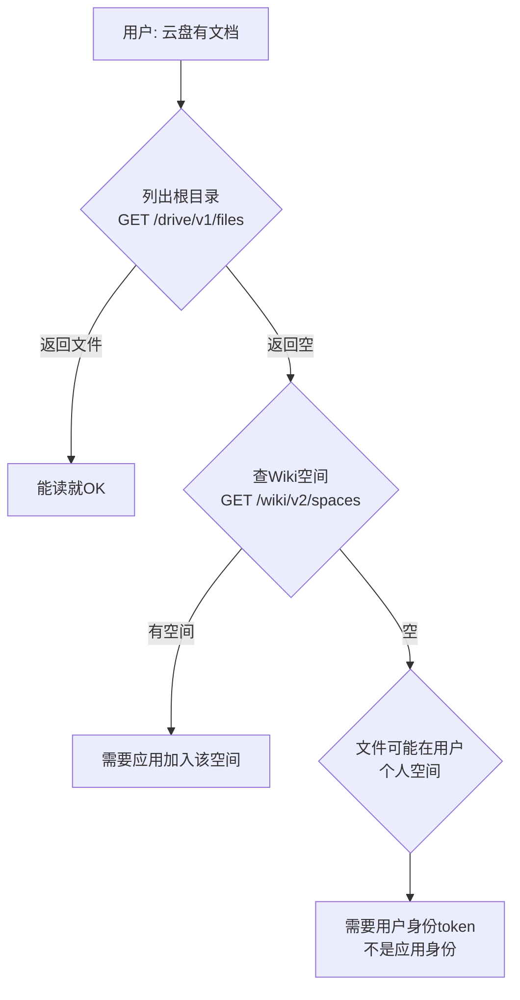

# Feishu Drive (云文档) API 操作指南

> 场景：通过飞书 Open API 读取云盘中的文档/文件/多维表格
> 凭证来源：`~/.hermes/.env` → `FEISHU_APP_ID` + `FEISHU_APP_SECRET`

## 权限开通

飞书应用默认没有云盘读写权限，需要单独开通：

1. 开发者后台 → **权限管理** → 找到 **云文档** 分类
2. 勾选 `drive:document`（读写）或 `drive:document:readonly`（只读）
3. 左侧 → **版本管理与发布** → 创建版本 → 发布
4. 等待 1-2 分钟后重新获取 token，新权限才生效

**关键规则：** 仅添加权限不生效——必须发布新版本。应用获取的 tenant_access_token 携带的是已发布版本的权限。

## 鉴权

```python
import requests

resp = requests.post(
    "https://open.feishu.cn/open-apis/auth/v3/tenant_access_token/internal",
    json={"app_id": app_id, "app_secret": app_secret},
    timeout=10
)
token = resp.json()["tenant_access_token"]
headers = {"Authorization": f"Bearer {token}"}
```

## 已验证的 API 端点

### 列出根目录文件

```python
GET /open-apis/drive/v1/files?page_size=50&order_by=EditedTime
# order_by 可选: EditedTime, CreatedTime（注意大小写敏感）
```

返回在应用"我的空间"根目录下的文件。对于仅开通了 `drive:document` 权限的应用，通常只包含：
- 应用自身创建的多维表格（bitable）
- 通过 API 创建的文档

```json
{
  "code": 0,
  "data": {
    "files": [
      {
        "type": "bitable",
        "token": "NzuPbMtMFa0wUusVQKwc69lenib",
        "name": "🧠 第二大脑搭建日志",
        "parent_token": "nodcnPWXboPJw09BmOHcBw2kmLe",
        "url": "https://my.feishu.cn/base/NzuPbMtMFa0wUusVQKwc69lenib",
        "owner_id": "ou_3dd5a8082b628c2ccfb9d2cbe927ebf7",
        "created_time": "1779361634",
        "modified_time": "1779852713"
      }
    ],
    "has_more": false
  }
}
```

**返回的文件类型：** `bitable`, `doc`, `docx`, `sheet`, `file`, `folder`

### 获取文件元数据

```python
POST /open-apis/drive/v1/metas/batch_query
{
  "request_docs": [
    {"doc_token": "nodcnPWXboPJw09BmOHcBw2kmLe", "doc_type": "folder"}
  ]
}
```

返回示例：
```json
{
  "code": 0,
  "data": {
    "metas": [{
      "doc_token": "nodcnPWXboPJw09BmOHcBw2kmLe",
      "doc_type": "other",
      "title": "My Space",
      "owner_id": "ou_3dd5a8082b628c2ccfb9d2cbe927ebf7",
      "create_time": "1779361312",
      "latest_modify_time": "1779361312"
    }]
  }
}
```

**parent_token 含义：** 根目录文件的 `parent_token` 通常指向应用的"My Space"根节点（title="My Space", doc_type="other"）。

### 查询知识库/空间列表

```python
GET /open-apis/wiki/v2/spaces?page_size=20
```

返回企业的知识库（Wiki）列表。如果返回空（`items: []`），说明应用未被添加至任何知识库。

## 两类空间的权限差异（核心理解）

飞书 Drive API 存在**两个空间**的概念，理解这个差异是排查一切问题的关键：

### 空间 A：应用空间（App's My Space）

- 应用自己的存储空间，通过 `GET /drive/v1/files` 可枚举
- parent_token = `nodcnPWXboPJw09BmOHcBw2kmLe`（固定值，title="My Space", doc_type="other"）
- 通常只包含应用自动创建的多维表格（bitable）
- **可枚举（列出文件列表）✅**
- 无需特殊授权

### 空间 B：用户个人空间（User's Personal Space）

- 用户自己在飞书里创建的文档、表格、文件夹
- 典型的 owner_id 类似 `ou_cd2311022a55e866069a20e491afb4a4`
- **不可枚举（无法列出目录树）❌** — *即使有 drive:document 权限*
- **但已知token可直接读取内容 ✅** — *drive:document 权限支持通过直接 token 读取*

**两种操作模式对比：**

| 操作 | App空间 | 用户个人空间 |
|------|---------|-------------|
| 枚举文件列表 | ✅ `GET /drive/v1/files` | ❌ 需要 user_access_token |
| 按token读取内容 | ✅ | ✅ 直接读（drive:document 足够） |
| 遍历文件夹 | ❌ children端点404 | ❌ |
| 查元数据 | ✅ batch_query | ✅ batch_query |
| 查权限成员 | ✅ permissions API | ✅ permissions API |

**核心结论：** tenant_access_token + drive:document = 能读已知token的文档，不能搜或遍历用户文件。要枚举用户个人空间，需要升级为用户OAuth授权（user_access_token）。

**⚠️ 额外 scope 需求：** 即使有了 `drive:drive` 和 `user_access_token`，`drive files list` 命令还需要 **`space:document:retrieve`** 这个 scope 才能列出用户个人空间的文件。缺少时错误信息：`insufficient permissions (required scope: space:document:retrieve)`。可通过 `lark-cli auth login --domain drive` 补充获取该 scope。

**CLI 替代方案：** 安装 `lark-cli` 并绑定到 Hermes Feishu 应用后，可通过 CLI 执行更丰富的 Drive 操作（见 `references/feishu-cli-installation.md`）。关键区别：CLI 设备流 OAuth 可以获取 `user_access_token`，从而枚举个人空间文件。

### 发现用户个人文档的实用方法

当用户说"云盘有文档，帮我读"时，排查流程：

1. **让用户贴一个文档URL** — 从URL提取token后即可直接读取
2. **查元数据区分空间归属** — 用 batch_query 看 owner_id：
   - owner_id = `ou_cd2311022a55e866069a20e491afb4a4` → 用户个人空间
   - owner_id = `ou_3dd5a8082b628c2ccfb9d2cbe927ebf7` → 应用空间
3. **查权限确认可读性** — permissions/{token}/public 看 link_share_entity 和 security_entity

## 已知限制/不工作的端点

| 端点 | 结果 | 说明 |
|------|------|------|
| `GET /drive/v1/files/{folder_token}/children` | 404 | My Space 根节点不支持 children 遍历 |
| `GET /drive/explorer/v2/folder/{folderToken}` | 404 | 该 API 已废弃或需要不同参数 |
| `GET /drive/v1/spaces` | 404 | 不存在该端点 |
| `POST /drive/v1/search` | 404 | 搜索 API 本配置下不可用 |
| `GET /drive/v1/files/{file_token}` | 404 (for bitable/docx) | 多维表格和文档都不是可下载文件 |
| `GET /drive/v1/files/{doc_token}` | 404 | 该端点不存在，读文档内容用 docx API |

## 可访问范围限制

飞书应用的 Drive API 只能访问：
1. **应用自身"我的空间"**(My Space) — 通过 API 创建或应用自带的文件
2. **被添加至/共享给应用的空间** — 需要额外配置

以下内容**不可见**（除非额外授权）：
- 用户个人的云盘目录结构（个人空间需 user_access_token 来枚举）
- 按token读取用户个人文档✅，但无法列出所有文件
- 共享空间（需应用被添加为协作者）
- 知识库文档（需应用被添加至知识库）

## 探查文档归属和权限

### 文档元数据（支持docx和bitable）

```python
POST https://open.feishu.cn/open-apis/drive/v1/metas/batch_query
{
  "request_docs": [
    {"doc_token": "{token}", "doc_type": "docx"}  # 或 bitable/folder/doc
  ]
}
```

返回包含 title、owner_id、create_time、latest_modify_time。

### 文档权限信息（了解分享范围）

```python
GET /open-apis/drive/v1/permissions/{doc_token}/public?type=docx
```

返回值包含：
- `link_share_entity`: `"tenant_readable"`（租户内可读）| `"anyone_readable"` | 等
- `security_entity`: `"any"`（任何人可用链接访问）| `"only_current_login"` 等

### 文档成员列表（查看协作者）

```python
GET /open-apis/drive/v1/permissions/{doc_token}/members?type=docx&page_size=50
```

返回示例：
```json
{
  "code": 0,
  "data": {
    "items": [{
      "member_id": "ou_cd2311022a55e866069a20e491afb4a4",
      "member_type": "openid",
      "perm": "full_access",
      "perm_type": "container"
    }]
  }
}
```

## 读取文档内容

不同文件类型需要不同的 API：

| 文件类型 | API 端点 | 说明 |
|---------|----------|------|
| 多维表格 (bitable) | `POST /bitable/v1/apps/{app_token}/tables/{table_id}/records/search` | 见 bitable API 参考 |
| 新版文档 (docx) | `GET /docx/v1/documents/{document_id}/raw_content` | 需要 `docx:document:readonly` 权限 |
| 电子表格 (sheet) | `GET /sheets/v3/spreadsheets/{spreadsheet_token}/values/{range}` | 需要 `sheet:sheet:readonly` 权限 |
| 老旧文档 (doc) | `GET /docs/v1/documents/{document_id}/raw_content` | 已不推荐使用 |

## 排错流程

当用户说"云盘里有文档"但 API 返回空时：



**常见原因：**
1. 文档在用户的**个人空间**，不在应用的 My Space — 需要让应用成为协作者，或使用 user_access_token
2. 文档在**共享空间** — 需要应用被添加为该空间的协作者
3. 文档在**知识库** — 需要应用加入知识库
4. 就是只有多维表格，没有独立文档 — 询问用户具体哪个文件

## 完整测试脚本

```python
import requests, json

APP_ID = "cli_xxxxxxxxxxxx"
APP_SECRET = "xxxxxxxxxxxx"

# 1. 获取 token
resp = requests.post(
    "https://open.feishu.cn/open-apis/auth/v3/tenant_access_token/internal",
    json={"app_id": APP_ID, "app_secret": APP_SECRET},
    timeout=10
)
token = resp.json()["tenant_access_token"]
headers = {"Authorization": f"Bearer {token}"}

# 2. 列出根目录
resp = requests.get(
    "https://open.feishu.cn/open-apis/drive/v1/files?page_size=50",
    headers=headers,
    timeout=15
)
files = resp.json()["data"]["files"]
print(f"共 {len(files)} 个文件")
for f in files:
    print(f"  [{f['type']}] {f['name']}")

# 3. 查一下 parent_token 是什么
if files:
    pt = files[0]["parent_token"]
    resp = requests.post(
        "https://open.feishu.cn/open-apis/drive/v1/metas/batch_query",
        headers=headers,
        json={"request_docs": [{"doc_token": pt, "doc_type": "folder"}]},
        timeout=15
    )
    print(f"根文件夹: {resp.json()['data']['metas'][0]['title']}")

# 4. 查知识库
resp = requests.get(
    "https://open.feishu.cn/open-apis/wiki/v2/spaces?page_size=20",
    headers=headers,
    timeout=15
)
print(f"知识库: {resp.json()['data']}")
```
